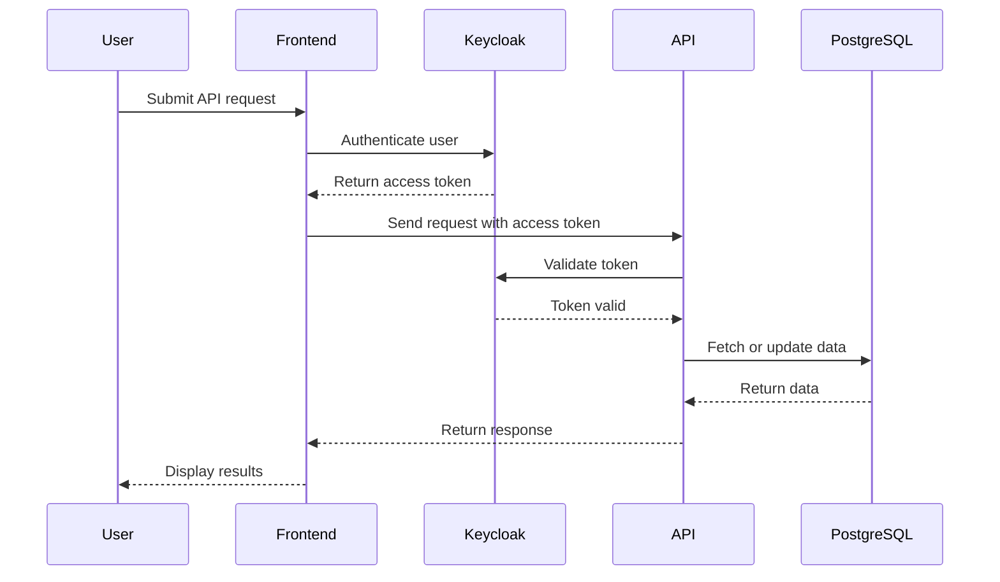

# 🚀 ScienceWings - Node.js Backend  

 

ScienceWings is a **multitenant and multilanguage** resource-sharing marketplace. This repository contains the **backend API**, responsible for handling authentication, resource management, and API communication.

It leverages **Keycloak for authentication** and **OpenAPI (Swagger) for API documentation and automatic client generation**.

---

## 📌 Features  

✅ **Multitenant architecture** – Supports multiple organizations with isolated data.  
✅ **Multilanguage support** – Built-in localization with i18n.  
✅ **Keycloak Authentication** – Secure login and authorization.  
✅ **Swagger Documentation** – Auto-generated API docs using OpenAPI.  
✅ **Docker Support** – Easily deploy the backend with `docker-compose`.  
✅ **PostgreSQL Integration** – Uses a relational database for structured data.  
✅ **Seeding System** – Pre-populates essential data into the database.  

---

## 📂 Project Structure  

```plaintext
/sciencewings-api
│── .github/workflows/      # CI/CD workflows
│── .vscode/                # VS Code settings
│── badges/                 # Badges and versioning
│── devops/                 # DevOps configurations
│── docker-images/          # Docker image builds
│── postman/                # API testing collection
│── src/                    # Source code
│   ├── client/             # OpenAPI client
│   ├── server/             # Main backend logic
│   ├── server-test/        # API tests
│── target/                 # Compiled output
│── .eslint.json            # ESLint configuration
│── .example.env            # Environment variables template
│── .gitignore              # Ignored files
│── .prettierrc.json        # Prettier formatting rules
│── Dockerfile              # Docker build instructions
│── README.md               # Documentation
│── bitbucket-pipelines.yml # CI/CD pipeline
│── docker-compose.yml      # Docker services
│── docker.yml              # Docker deployment script
│── init.js                 # Initialization script
│── nodemon.json            # Nodemon configuration
│── package-lock.json       # Dependency lockfile
│── package.json            # Project dependencies and scripts
│── swaggerConfig.json      # Swagger configuration
```

---

## 💻 Requirements  

Before running the project, ensure you have:  

- [Node.js 14+](https://nodejs.org/en/download/) (Consider using **nvm** for version management)
- [Docker](https://www.docker.com/) for containerized services
- [Docker VS Code Extension](https://code.visualstudio.com/docs/containers/overview) (Recommended)
- [PostgreSQL](https://www.postgresql.org/) (If running outside Docker)
- [Keycloak](https://www.keycloak.org/) for authentication

### 🛠 Optional: Developer Tools  

- [iterm2](https://iterm2.com/) for a better terminal experience  
- [ESLint](https://marketplace.visualstudio.com/items?itemName=dbaeumer.vscode-eslint) for linting  
- [Prettier](https://marketplace.visualstudio.com/items?itemName=esbenp.prettier-vscode) for code formatting  
- [Sort Imports](https://marketplace.visualstudio.com/items?itemName=amatiasq.sort-imports) for clean imports  
- **VS Code Extensions**:  
  - [TODO Tree](https://marketplace.visualstudio.com/items?itemName=Gruntfuggly.todo-tree)  
  - [Bracket Pair Colorizer](https://marketplace.visualstudio.com/items?itemName=CoenraadS.bracket-pair-colorizer-2)  
  - [Error Lens](https://marketplace.visualstudio.com/items?itemName=usernamehw.errorlens)  
  - [GitLens](https://marketplace.visualstudio.com/items?itemName=eamodio.gitlens)  

---

## 🚀 Getting Started  

### 🔑 Setting Up the Environment  

1. **Clone the repository**  
   ```sh
   git clone git@bitbucket.org:science-wings/api.git
   cd sciencewings-api
   ```

2. **Create an SSH key for Bitbucket** *(if required)*  
   ```sh
   ssh-keygen -t rsa -b 4096 -C "your-email@example.com"
   ```

3. **Switch to the development branch**  
   ```sh
   git checkout dev
   ```

4. **Copy the example environment file and configure it**  
   ```sh
   cp .example.env .env
   ```

---

## 📦 Running the Project  

Run the following commands to start the backend:  

```sh
npm run init
npm run watch
npm run swagger-gen
npm run start-local-containers
npm run dev
npm run permission-seed
```

| Command                        | Description |
|--------------------------------|-------------|
| `npm run init`                 | Initialize project dependencies |
| `npm run build`                | Compile TypeScript to JavaScript |
| `npm run watch`                | Auto-recompiles code on changes |
| `npm run swagger-gen`          | Generates OpenAPI documentation |
| `npm run start-local-containers` | Starts PostgreSQL and Keycloak via Docker |
| `npm run dev`                  | Starts the backend server |
| `npm run permission-seed`      | Seeds the permissions table |

---

## 🔄 API Documentation  

Once the backend is running, access the API documentation:  

- **Check server health**: `GET /health`  
- **Swagger API Documentation**: [http://localhost:3000/api/docs/](http://localhost:3000/api/docs/)  

---

## 🔐 Keycloak Authentication  

ScienceWings integrates **Keycloak** for authentication and access control. The authentication flow works as follows:  

1. The frontend redirects users to Keycloak for login.  
2. After successful login, Keycloak provides an **access token**.  
3. The frontend uses this token to authenticate API requests.  
4. The backend verifies the token before processing the request.  

This ensures **secure resource sharing** while **maintaining role-based access control (RBAC)** within an organization.

---

## 📊 Sequence Diagram  



---

## 📜 License  

This project is licensed under the **GPLv3**. See [LICENSE.md](LICENSE.md) for details.  

---

## 📖 Additional Resources  

- [Node.js Documentation](https://nodejs.org/)  
- [Keycloak Documentation](https://www.keycloak.org/)  
- [OpenAPI Generator](https://openapi-generator.tech/)  
- [Swagger Docs](https://swagger.io/)  
- [PostgreSQL Docs](https://www.postgresql.org/docs/)  
- [Docker Documentation](https://docs.docker.com/)  

For further assistance, run:  
```sh
npm help
```
