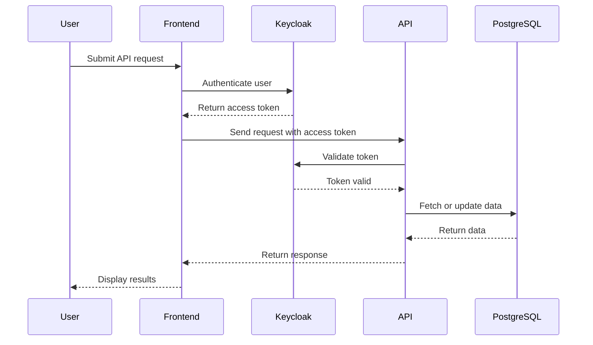

# 🚀 ScienceWings - Node.js Backend  

   

ScienceWings is a **multitenant and multilanguage** resource-sharing marketplace. This repository contains the **backend API**, responsible for handling authentication, resource management, and API communication.

It leverages **Keycloak for authentication**, **PostgreSQL for data storage**, and **OpenAPI (Swagger) for automatic API documentation and client generation**.

---

## 🏛️ Architecture Overview  

ScienceWings follows a **modular, layered architecture** to ensure scalability, maintainability, and separation of concerns.

### **🧩 Modular Structure**  

Each domain (such as **organizations**, **resources**, **users**) is treated as a separate module, containing its own **data access layer, business logic, and API routes**.

Example: The **Organizations Module** (`src/server/modules/organizations/`):

```plaintext
/src/server/modules/organizations/
│── daos/            # Data access layer (database queries)
│── dtos/            # Data transfer objects (request/response validation)
│── interfaces/      # TypeScript interfaces for type safety
│── models/          # ORM models (database schema definitions)
│── routes/          # API endpoints for the module
│── schemas/         # Database schema definitions
│── services/        # Business logic for the module
│── index.ts         # Entry point for the module
│── organizationtypes.ts # Enum/constants related to organizations
```

### **🏗️ Layered Architecture**  

ScienceWings API is structured into **four primary layers**:

1️⃣ **Controllers (Routes)**:  
   - Handles HTTP requests and calls the corresponding service methods.  
   - Example: `src/server/modules/organizations/routes/organizationRoutes.ts`  

2️⃣ **Services (Business Logic)**:  
   - Implements core functionality and interacts with DAOs.  
   - Example: `src/server/modules/organizations/services/organizationService.ts`  

3️⃣ **DAOs (Data Access Layer)**:  
   - Responsible for database operations (CRUD).  
   - Example: `src/server/modules/organizations/daos/organizationDao.ts`  

4️⃣ **Models & Schemas (Data Layer)**:  
   - Defines PostgreSQL tables using MikroORM.  
   - Example: `src/server/modules/organizations/models/organizationModel.ts`  

This modular approach allows for **scalability**, **easier maintenance**, and **independent testing** of each module.

---

## 📌 Features  

✅ **Multitenant architecture** – Supports multiple organizations with isolated data.  
✅ **Multilanguage support** – Built-in localization with i18n.  
✅ **Keycloak Authentication** – Secure login and authorization.  
✅ **Swagger Documentation** – Auto-generated API docs using OpenAPI.  
✅ **MikroORM** – Object-Relational Mapping for PostgreSQL.  
✅ **Docker Support** – Easily deploy the backend with `docker-compose`.  
✅ **Permission System** – Fine-grained RBAC for access control.  

## 🚀 Getting Started  

### 🔑 Setting Up the Environment  

1. **Clone the repository**  
   ```sh
   git clone git@bitbucket.org:science-wings/api.git
   cd sciencewings-api
   ```

2. **Create an SSH key for Bitbucket** *(if required)*  
   ```sh
   ssh-keygen -t rsa -b 4096 -C "your-email@example.com"
   ```

3. **Switch to the development branch**  
   ```sh
   git checkout dev
   ```

4. **Copy the example environment file and configure it**  
   ```sh
   cp .example.env .env
   ```

---

## 📦 Running the Project  

Run the following commands to start the backend:  

```sh
npm run init
npm run watch
npm run swagger-gen
npm run start-local-containers
npm run dev
npm run permission-seed
```

| Command                        | Description |
|--------------------------------|-------------|
| `npm run init`                 | Initialize project dependencies |
| `npm run build`                | Compile TypeScript to JavaScript |
| `npm run watch`                | Auto-recompiles code on changes |
| `npm run swagger-gen`          | Generates OpenAPI documentation |
| `npm run start-local-containers` | Starts PostgreSQL and Keycloak via Docker |
| `npm run dev`                  | Starts the backend server |
| `npm run permission-seed`      | Seeds the permissions table |

---

## 🔄 API Documentation  

Once the backend is running, access the API documentation:  

- **Check server health**: `GET /health`  
- **Swagger API Documentation**: [http://localhost:3000/api/docs/](http://localhost:3000/api/docs/)  

---

## 🔐 Keycloak Authentication  

ScienceWings integrates **Keycloak** for authentication and access control. The authentication flow works as follows:  

1. The frontend redirects users to Keycloak for login.  
2. After successful login, Keycloak provides an **access token**.  
3. The frontend uses this token to authenticate API requests.  
4. The backend verifies the token before processing the request.  

This ensures **secure resource sharing** while **maintaining role-based access control (RBAC)** within an organization.

---

## 📊 Sequence Diagram  



---

## 📜 License  

This project is licensed under the **GPLv3**. See [LICENSE.md](LICENSE.md) for details.  

---

## 📖 Additional Resources  

- [Node.js Documentation](https://nodejs.org/)  
- [Keycloak Documentation](https://www.keycloak.org/)  
- [OpenAPI Generator](https://openapi-generator.tech/)  
- [Swagger Docs](https://swagger.io/)  
- [PostgreSQL Docs](https://www.postgresql.org/docs/)  
- [Docker Documentation](https://docs.docker.com/)  

For further assistance, run:  
```sh
npm help
```
